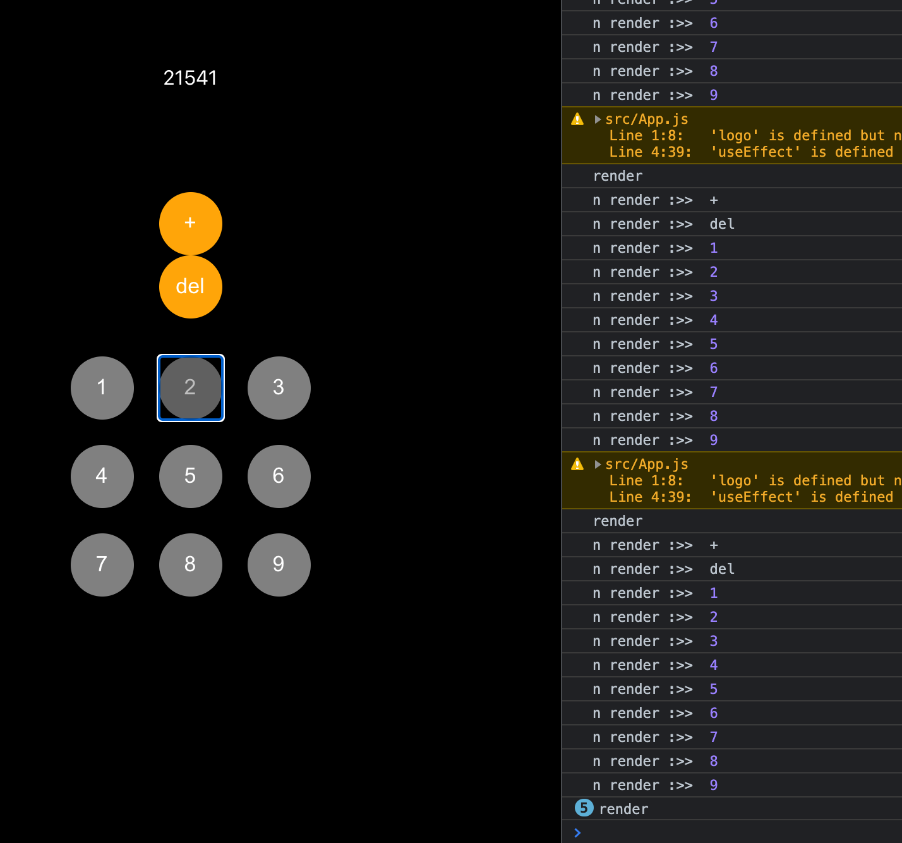

## React Memo

REACT는 컴포넌트를 렌더링 한뒤 , 이전 렌더된 결과와 비교하여 dom 업데이트를 결정한다. 렌더 결과가 다르다면, dom을 업데이트 한다.

```jsx
import React, { memo } from "react";

const Button = ({ n, className, onClick }) => {
  console.log("n render :>> ", n);
  return (
    <button id={n} className={className} onClick={onClick}>
      {n}
    </button>
  );
};

export default memo(Button);
```

컴퍼넌트가 React.memo()로 래핑 될 때, React는 컴퍼넌트를 렌더링하고 결과를 메모이징(Memoizing)한다.
그리고 다음 렌더링이 일어날 때 props가 같다면, React는 메모이징(Memoizing)된 내용을 재사용한다.

React.memo는 위와 같이 사용되며 직접 컴포넌트를 감싸서 사용한다. React.memo는 Button의 결과를 `Memoization(이전 값을 메모리에 저장해 동일한 계산의 반복을 제거)`해서 리렌더링을 막는다.

이렇게 Memoized된 내용을 재사용하여 렌더시 가상 DOM에서 바뀐 부분이 확인하지 않아 성능이 향상된다.

`react.memo`혹은 `react.useCallback`만 사용했을 때이다.


만약 이런 렌더링을 막고싶다면

`react.memo`와 `react.useCallback`모두 사용하여 랜더링을 방지할수 있다.
모두 사용했을때 사진과 같이 렌더링을 방지한 것을 알 수 있다.

